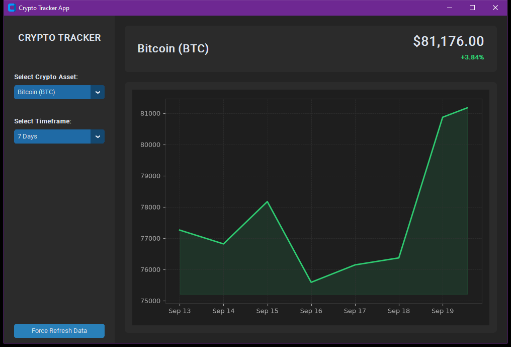

# MASA CryptoPulse Tracker

Live cryptocurrency market tracker and volatility analysis tool supporting top market cap assets

## Technical Architecture

The application is architected with modular separation of concerns adhering to modern clean code standards:

- **Component Layering**: Isolated view layouts, state managers, and service controllers.
- **Defensive Engineering**: Robust input sanitization and exception management.
- **Modern Design Standards**: High-contrast dark-mode interface styled for optimal usability and visual polish.

## Preview



## Features

- Real-time asset pricing integration via CoinGecko public market API.
- Multi-currency support (USD, EUR, GBP) and 24h percentage change delta visualization.
- Automated background refresh cycles with non-blocking updates.
- Color-coded bullish/bearish indicators with clean typography.

## Prerequisites

- Python 3.10 or higher
- Required packages:

```bash
pip install customtkinter pillow requests
```

## Execution

Launch the application via Python:

```bash
python "Crypto Tracker App Using Tkinter in Python/main.py"
```

## Project Structure

```
.
├── Crypto Tracker App Using Tkinter in Python
├── screenshots/
│   └── app_interface.png
├── .gitignore
├── LICENSE             # MIT License
└── README.md           # Developer documentation
```

## License

This project is licensed under the terms of the MIT License. Refer to the `LICENSE` file for details.
